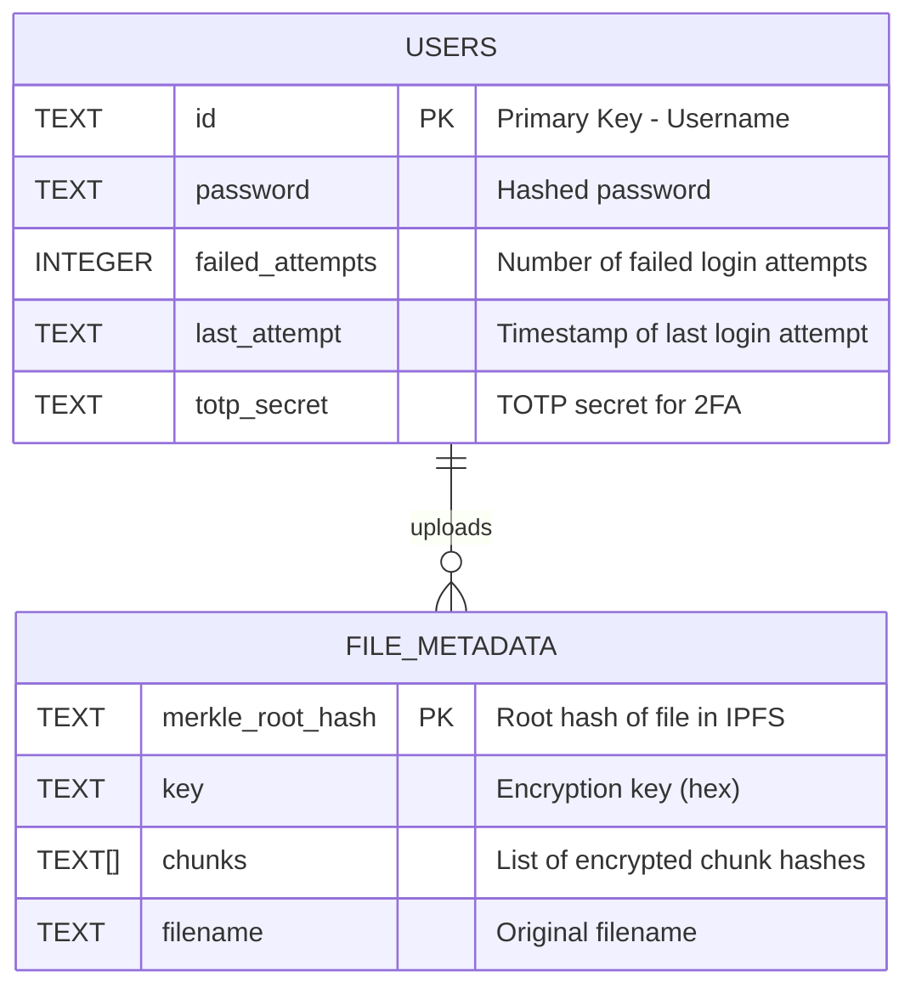

# Entity-Relationship Diagram (ER Diagram) for the Project

Notes:
- The USERS table is stored in the SQLite database `users.db`.
- FILE_METADATA is stored as JSON files in the downloads directory, not in the database.
- The relationship indicates that a user can upload multiple files (file metadata).
- File chunks are stored in IPFS with encryption and chunking handled by the backend.

This ER diagram summarizes the main data entities and their relationships in the project.
